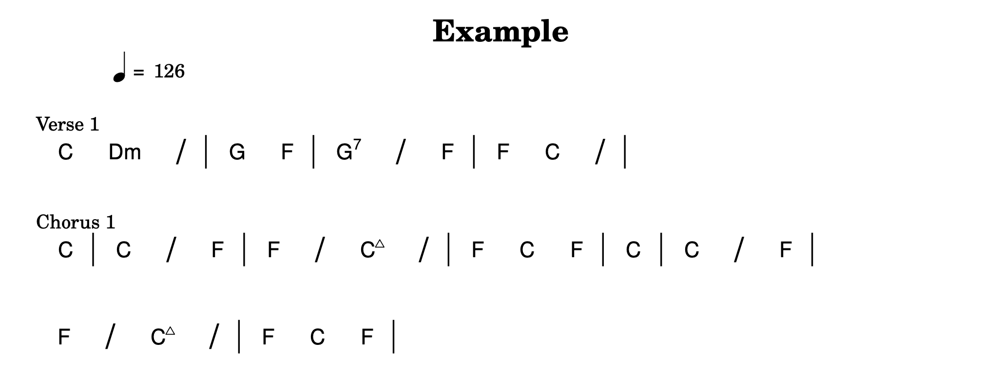

# Chord Striker



A Python library for generating random harmonic song structures. The results are formatted into PDF chord charts by Lilypond, and supplied with an accompanying MIDI file. If you're stuck in a creative rut, this can be an excellent way to start writing a new song! I like to load the MIDI file into a DAW and start building on top of it.

Example outputs can be seen in the [example directory](./example).


## Features

- Generate random chord progressions with musical coherence
- Create full song structures with intros, verses, pre-choruses, choruses, and so on
- Add realistic variations to chord progressions
- Export to PDF chord charts using Lilypond
- Generate accompanying MIDI files
- Cross-platform support via Docker
- Create full albums of songs

## How It Works

Chord Striker uses probability and music theory to generate song structures. 

- First, a section layout is generated. This works by sampling from a probabilistic directed acyclic graph (DAG) that models common song transitions. The details can be found in `chord_striker/probabilistic_dag.py` and `chord_striker/song_structure.py`. An example of a generated song structure graph can be seen in [example/song_structure_graph.png](./example/song_structure_graph.png).
- Then each section is populated with chord progressions. These are generated in one of two ways: either by sampling from a list of pre-defined "famous" chord progressions, or from a Markov chain that models how chords transition between one another. The details can be found in `chord_striker/chorder.py`. Repetitions of sections may have small variations (e.g. a chord change, an added chord, or a different length).
- Finally, the resulting song structure is exported to Lilypond, which converts it into a PDF chord chart and accompanying MIDI file.

There are a number of parameters that can be modified to change the sound of the generated songs. These are stored in YAML files in the `constants` directory. When running from source, the package will first look for custom parameters in the subdirectory `constants/user`, falling back to the defaults in `constants/defaults` if none are found. When installed as a package, it uses the built-in default constants, but you can still specify a custom directory of parameters when calling the functions directly. Experimenting with these is a good way to impart your own style onto the generated songs.

The default chord transition probabilities and extension weights are derived from the [McGill Billboard dataset](https://ddmal.music.mcgill.ca/research/The_McGill_Billboard_Project_(Chord_Analysis_Dataset)). The code for processing this dataset can be found in `scripts/process_mcgill_dataset.py`, and there is a makefile target to run it: `make process-billboard`.

## Installation

### Installing as a Python Package (Recommended)

Chord Striker can be installed as a Python package using pip:

```bash
# Install the package
pip install chord-striker

# Or install in development mode (for local development)
pip install -e .
```

**Requirements:**
- Python 3.10 or later
- Lilypond (version 2.22.1 or later) - must be installed separately and available in your PATH

**Optional Dependencies:**
- Graph visualization: `pip install chord-striker[graph]` (requires system Graphviz library)

Once installed, you can use the `chord-striker` command-line tool from anywhere:

```bash
chord-striker --help
```

### Using Docker (Alternative)

The easiest way to get started with all dependencies pre-configured is using Docker:

```bash
# Build the Docker image
make docker

# Enter the container
make enter
```

### Manual Installation

1. Install Python 3.10 or later
2. Install Lilypond (version 2.22.1 or later)
3. Install the Python dependencies:
   ```bash
   pip install -r docker/requirements.txt
   ```

## Usage

### Command Line Interface

If installed as a package, use the `chord-striker` command:

```bash
# Generate a single song
chord-striker --key C --tempo 120 --song_name "My Song" --seed 42

# Generate an album (multiple songs)
chord-striker --num_songs 10

# See all options
chord-striker --help
```

Or using the makefile (if running from source):

```bash
# Generate a single song
make run-song

# Generate a song with specific parameters
make run-song SONG_NAME="My Song" SEED=42 TEMPO=120 KEY=D

# Generate multiple songs (default: 10)
make run-album
```

### Python API

You can also use Chord Striker as a Python library:

```python
from chord_striker import create_song, create_album

# Generate a single song
create_song(
    key="C",
    tempo=120,
    seed=42,
    song_name="My Song",
    output_dir="output"
)

# Generate an album
create_album(
    album_name="My Album",
    num_tracks=10,
    output_dir="output"
)

# Access song structure generation
from chord_striker import generate_song_structure, ChordChart

# Generate just the structure
structure = generate_song_structure(print_graph=True)

# Create a chord chart from existing data
chart = ChordChart(...)
chart.generate_pdf_midi("output/my_song.pdf")
```


### Output

The generated files will be placed in the `example` directory by default. Each song generation creates:
- A PDF chord chart
- A MIDI file
- A Lilypond source file
- An auxiliary file for Lilypond containing the chord symbols

### Customisation

You can customise the output of `make run-song` with the following options:
- `SONG_NAME`: Name of the generated song
- `SEED`: Random seed for reproducible results
- `OUTPUT_DIR`: Directory for generated files
- `ALBUM_TRACKS`: Number of songs to generate (for `run-album`)
- `PRINT_GRAPH`: Whether to print the song structure graph
- `CONSTANTS_DIR`: Directory containing custom YAML parameter files

`CONSTANTS_DIR` should be a subdirectory of `constants`, and should contain the same files and schema as the `constants/defaults` directory:
- `structure_params.yaml`: Song structure probabilities
- `chord_change_probs.yaml`: Chord transition probabilities
- `key_probs.yaml`: Key probabilities
- `chord_extensions.yaml`: Chord extension probabilities
- `famous_chord_progressions.yaml`: Pre-defined chord progressions


## Development

### Development Installation

To contribute to Chord Striker, install it in development mode:

```bash
# Clone the repository
git clone <repository-url>
cd chord-striker

# Install in editable mode with development dependencies
pip install -e ".[dev]"

# Optional: Install graph visualization dependencies
pip install -e ".[graph]"  # Requires system Graphviz library
```

### Project Structure

```
chord-striker/
├── assets/              # Static assets
├── chord_striker/       # Main Python package
│   ├── __init__.py      # Package initialization and public API
│   ├── _resources.py    # Resource path utilities
│   ├── chorder.py       # Chord generation logic
│   ├── create_chord_chart.py  # PDF/MIDI generation
│   ├── hit_maker.py     # Main song creation functions
│   ├── load_constants.py # Configuration loading
│   ├── probabilistic_dag.py  # DAG-based structure generation
│   ├── section.py       # Section representation
│   ├── song_structure.py # Song structure generation
│   ├── constants/       # Package constants (YAML files)
│   └── lilypond_assets/ # Lilypond template files
├── docker/              # Docker configuration
├── example/             # Generated output
├── scripts/             # Utility scripts
├── tests/               # Test suite
├── constants/           # Musical constants (development)
│   ├── defaults/        # Default parameters
│   └── user/            # Custom parameters (git-ignored)
├── pyproject.toml       # Package configuration
└── README.md            # This file
```

### Running Tests

```bash
# Using makefile (runs in Docker)
make test

# Or directly with pytest (if installed)
pytest tests/
```

### Code Quality

This project uses `ruff` for linting and formatting. Pre-commit hooks are configured:

```bash
# Install pre-commit hooks
pre-commit install

# Run checks manually
pre-commit run --all-files
```

### Building for All Platforms

To build Docker images for both ARM64 and AMD64:

```bash
make docker-all
```

Note: This requires a Docker registry for pushing the images.

## License

This project is licensed under the GNU General Public License v3.0 - see the [LICENSE](LICENSE) file for details.

## Contributing

Contributions are welcome! Please make changes to a fork and open a pull request. Run `make test` to ensure your changes are compatible with the existing code.

### Questions?

Feel free to open an issue for any questions or suggestions!

